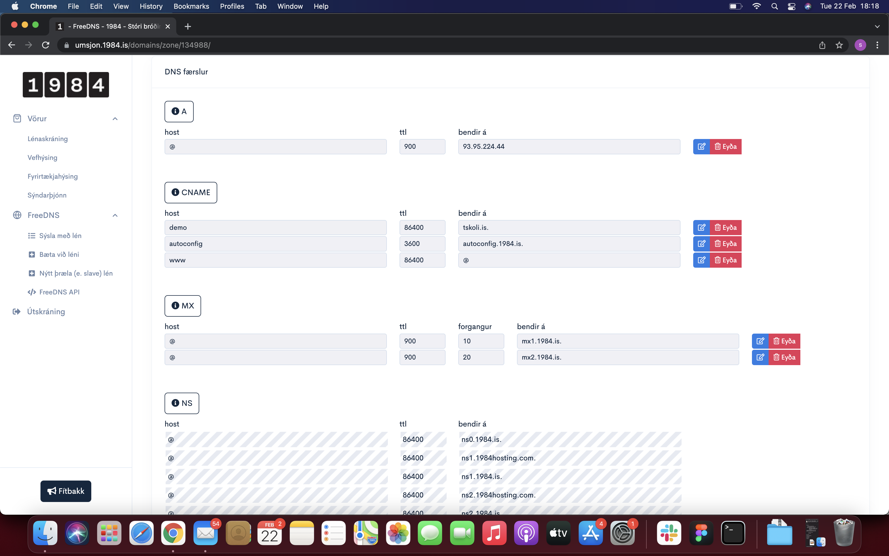

# Back End - DNS - Module 5

# Project Description - from tskoli.io

Domain Name Servers (or DNS) are actually just a key-value based database. Their role is to change the domain name that we type into the browser (like for example io.tskoli.dev) into an IP number that is used by internet infrastructure like routers, switches and wireless access-points.

Front-end developers do not need to worry to much about DNS servers (at least not as much as network administrators) but when it comes to hosting your website you will face the task of configuring a DNS server. That side of DNS is what this guide is all about.

Topics

- DNS
- IP protocol
- IPv4 \*
- DNS record

# Configuring DNS servers:

Read through this article about DNS (https://code.tutsplus.com/tutorials/an-introduction-to-learning-and-using-dns-records--cms-24704)

- Sign up for a free DNS service at 1984

- Once you have logged in you will see in the left side menu a link called “Free DNS”

- Click it and add a new domain name
  For the purpose of practice you can just make up a .com domain name to put here. Like example YYYY.com where YYYY is any word you can think of

  Now let’s assume that you have a hosting service with the permanent, public IP address 100.101.110.111

- Now edit the DNS so that whenever someone goes to example YYYY.com it will point to your server.
- Also make it work so that whenever someone enters demo.YYYY.com it will go to tskoli.is pages.
  Now take a screenshot of this and push the image to a repository you make.

